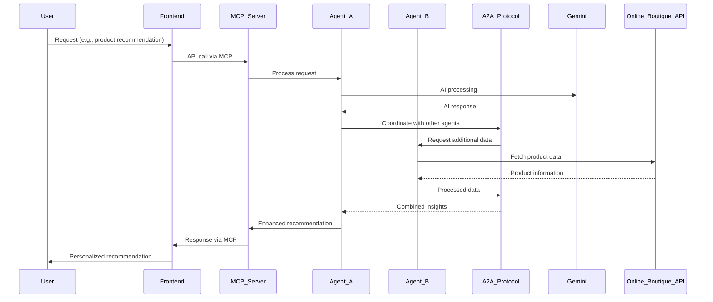
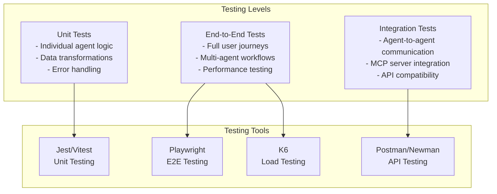

# AI-Powered Online Boutique Enhancement - Design Document

## Overview

This design document outlines the architecture for transforming the Google Cloud Online Boutique microservices demo into an intelligent, AI-powered e-commerce platform for the GKE Turns 10 Hackathon. The solution introduces 13 specialized AI agents that enhance the shopping experience through advanced capabilities like virtual try-on, mood-based recommendations, dynamic pricing, and real-time style analysis.

The architecture leverages Google's Agent Development Kit (ADK), Gemini models, Model Context Protocol (MCP), Agent2Agent (A2A) protocol, kubectl-ai, and Gemini CLI to create a modular, scalable, and developer-friendly system that integrates seamlessly with the existing Online Boutique microservices without modifying their core code.

## Architecture

### High-Level Architecture

```mermaid
graph TB
    subgraph "GKE Cluster"
        subgraph "Existing Online Boutique Services"
            FE[Frontend Service]
            PS[Product Catalog Service]
            CS[Cart Service]
            RS[Recommendation Service]
            AS[Ad Service]
            ES[Email Service]
            CHS[Checkout Service]
            PAS[Payment Service]
            SS[Shipping Service]
            CUS[Currency Service]
        end
        
        subgraph "AI Agent Layer (New)"
            subgraph "Core Agents"
                RT[Review Tracker Agent]
                ARS[Advanced Recommendation Agent]
                CB[AI Chatbot Agent]
                SC[Sales Countdown Agent]
                DP[Dynamic Pricing Agent]
            end
            
            subgraph "Personalization Agents"
                PME[Marketing Email Agent]
                GR[Gift Recommender Agent]
                VTO[Virtual Try-On Agent]
                MBS[Mood-Based Shopping Agent]
                CR[Chain Recommendations Agent]
            end
            
            subgraph "Analytics Agents"
                IA[Inventory Analysis Agent]
                DA[Donations Agent]
                SA[Style Analysis Agent]
            end
        end
        
        subgraph "Infrastructure Layer"
            subgraph "MCP Servers"
                MCP1[Boutique API MCP Server]
                MCP2[Analytics MCP Server]
                MCP3[ML Models MCP Server]
            end
            
            subgraph "ADK Runtime"
                ADK[ADK Agent Runtime]
                A2A[A2A Protocol Handler]
                KUBECTL[kubectl-ai Integration]
            end
        end
        
        subgraph "Google AI Services"
            GEMINI[Gemini Pro/Vision/Code]
            VAI[Vertex AI Platform]
        end
    end
    
    subgraph "External Tools"
        CLI[Gemini CLI]
        K8S[kubectl-ai]
    end
    
    %% Connections
    FE --> MCP1
    PS --> MCP1
    CS --> MCP1
    
    RT --> MCP1
    ARS --> MCP1
    CB --> MCP1
    SC --> MCP1
    DP --> MCP1
    PME --> MCP1
    GR --> MCP1
    VTO --> MCP1
    MBS --> MCP1
    CR --> MCP1
    IA --> MCP2
    DA --> MCP1
    SA --> MCP3
    
    RT --> A2A
    ARS --> A2A
    CB --> A2A
    VTO --> A2A
    SA --> A2A
    
    ADK --> GEMINI
    MCP3 --> VAI
    
    CLI --> ADK
    K8S --> ADK
```



### Agent Communication Architecture



## Components and Interfaces

### 1. MCP Server Layer

#### Boutique API MCP Server
- **Purpose**: Standardized interface to existing Online Boutique APIs
- **Endpoints**:
  - `/products` - Product catalog access
  - `/cart` - Shopping cart operations
  - `/orders` - Order management
  - `/users` - User session management
- **Features**:
  - Request/response transformation
  - Rate limiting and caching
  - Error handling and retry logic
  - Real-time data streaming

#### Analytics MCP Server
- **Purpose**: Data aggregation and analytics interface
- **Endpoints**:
  - `/analytics/sales` - Sales data and trends
  - `/analytics/inventory` - Inventory levels and forecasting
  - `/analytics/user-behavior` - User interaction patterns
- **Features**:
  - Data aggregation from multiple sources
  - Real-time analytics processing
  - Historical data access

#### ML Models MCP Server
- **Purpose**: Interface to Gemini models and Vertex AI
- **Endpoints**:
  - `/ai/chat` - Conversational AI
  - `/ai/vision` - Image analysis and virtual try-on
  - `/ai/recommendations` - ML-powered recommendations
- **Features**:
  - Model versioning and A/B testing
  - Response caching and optimization
  - Multi-modal AI capabilities

### 2. AI Agent Components

#### Core Shopping Agents

**Review Tracker Agent**
- **Interface**: RESTful API + A2A protocol
- **Key Methods**:
  - `analyzeReview(reviewText, productId)`
  - `getSentimentAnalysis(productId)`
  - `detectFakeReviews(reviews[])`
- **Data Models**:
  ```typescript
  interface ReviewAnalysis {
    productId: string;
    sentimentScore: number; // -1 to 1
    keyThemes: string[];
    authenticityScore: number; // 0 to 1
    recommendationImpact: number;
  }
  ```

**Advanced Recommendation Agent**
- **Interface**: GraphQL API + A2A protocol
- **Key Methods**:
  - `getPersonalizedRecommendations(userId, context)`
  - `getComplementaryProducts(productIds[])`
  - `updateUserPreferences(userId, interactions[])`
- **Data Models**:
  ```typescript
  interface RecommendationRequest {
    userId: string;
    currentCart: Product[];
    browsingHistory: ProductView[];
    preferences: UserPreferences;
    context: ShoppingContext;
  }
  
  interface RecommendationResponse {
    products: Product[];
    confidence: number;
    reasoning: string;
    alternatives: Product[];
  }
  ```

**AI Chatbot Agent**
- **Interface**: WebSocket + Voice API + A2A protocol
- **Key Methods**:
  - `processTextMessage(message, sessionId)`
  - `processVoiceInput(audioData, sessionId)`
  - `generateResponse(intent, context)`
- **Features**:
  - Multi-modal interaction (text, voice, video)
  - Context-aware conversations
  - Integration with all other agents
  - Real-time streaming responses

#### Personalization Agents

**Virtual Try-On Agent**
- **Interface**: WebRTC + REST API + A2A protocol
- **Key Methods**:
  - `analyzeUserFeatures(imageData)`
  - `renderVirtualTryOn(productId, userFeatures)`
  - `generateFitScore(product, userMeasurements)`
- **Data Models**:
  ```typescript
  interface UserAnalysis {
    skinTone: string;
    faceShape: string;
    bodyType: string;
    measurements: BodyMeasurements;
    colorPalette: string[];
  }
  
  interface TryOnResult {
    renderedImage: string;
    fitScore: number; // 1-10
    styleRecommendations: string[];
    alternatives: Product[];
  }
  ```

**Style Analysis Agent**
- **Interface**: Computer Vision API + A2A protocol
- **Key Methods**:
  - `analyzeRealTimeFeatures(videoStream)`
  - `generateStyleRecommendations(userFeatures, preferences)`
  - `scoreOutfitCompatibility(products[], userFeatures)`
- **Features**:
  - Real-time computer vision processing
  - 10-point scoring system
  - Style compatibility analysis
  - Trend integration

### 3. Infrastructure Components

#### ADK Agent Runtime
- **Purpose**: Standardized agent lifecycle management
- **Features**:
  - Hot-reload for development
  - Health monitoring and auto-recovery
  - Resource optimization
  - Distributed tracing

#### A2A Protocol Handler
- **Purpose**: Inter-agent communication orchestration
- **Features**:
  - Service discovery
  - Message routing and transformation
  - Workflow orchestration
  - Error handling and compensation

#### kubectl-ai Integration
- **Purpose**: Intelligent Kubernetes operations
- **Features**:
  - Automated scaling decisions
  - Resource optimization
  - Intelligent troubleshooting
  - Performance monitoring

## Data Models

### Core Data Structures

```typescript
// User Context and Preferences
interface UserContext {
  sessionId: string;
  userId?: string;
  demographics: UserDemographics;
  preferences: UserPreferences;
  currentMood: MoodState;
  shoppingIntent: ShoppingIntent;
  deviceInfo: DeviceInfo;
}

interface UserPreferences {
  stylePreferences: StyleProfile;
  priceRange: PriceRange;
  brandPreferences: string[];
  colorPreferences: string[];
  sizeProfile: SizeProfile;
  sustainabilityPreferences: SustainabilityProfile;
}

// Product Enhancement
interface EnhancedProduct {
  // Original Online Boutique product data
  id: string;
  name: string;
  description: string;
  picture: string;
  priceUsd: Money;
  categories: string[];
  
  // AI-enhanced data
  aiAnalysis: ProductAIAnalysis;
  reviewAnalysis: ReviewAnalysis;
  styleAttributes: StyleAttributes;
  personalizedScore: number;
  virtualTryOnAvailable: boolean;
}

interface ProductAIAnalysis {
  colorPalette: string[];
  styleCategory: string;
  occasion: string[];
  seasonality: string[];
  targetDemographics: string[];
  complementaryProducts: string[];
}

// Shopping Session
interface ShoppingSession {
  sessionId: string;
  userId?: string;
  startTime: Date;
  currentCart: CartItem[];
  browsingHistory: ProductView[];
  interactions: UserInteraction[];
  mood: MoodState;
  intent: ShoppingIntent;
  agentRecommendations: AgentRecommendation[];
}

// Agent Communication
interface AgentMessage {
  messageId: string;
  fromAgent: string;
  toAgent: string;
  messageType: MessageType;
  payload: any;
  timestamp: Date;
  correlationId: string;
}

interface AgentRecommendation {
  agentId: string;
  type: RecommendationType;
  confidence: number;
  reasoning: string;
  data: any;
  expiresAt: Date;
}
```

### Specialized Data Models

```typescript
// Virtual Try-On Models
interface BodyMeasurements {
  height: number;
  weight?: number;
  chest: number;
  waist: number;
  hips: number;
  shoulderWidth: number;
  armLength: number;
  legLength: number;
}

interface FaceAnalysis {
  faceShape: 'oval' | 'round' | 'square' | 'heart' | 'diamond';
  skinTone: string;
  eyeColor: string;
  hairColor: string;
  facialFeatures: FacialFeatures;
}

// Mood and Context Models
interface MoodState {
  primary: 'happy' | 'excited' | 'calm' | 'stressed' | 'celebratory' | 'focused';
  intensity: number; // 1-10
  confidence: number; // 0-1
  detectedFrom: 'behavior' | 'explicit' | 'context';
  timestamp: Date;
}

interface ShoppingIntent {
  type: 'browse' | 'specific_item' | 'gift' | 'occasion' | 'replacement';
  urgency: 'low' | 'medium' | 'high';
  budget: PriceRange;
  occasion?: string;
  recipient?: RecipientProfile;
}

// Analytics Models
interface InventoryForecast {
  productId: string;
  currentStock: number;
  predictedDemand: number[];
  recommendedReorder: number;
  confidence: number;
  factors: ForecastFactor[];
}

interface SalesAnalytics {
  period: DateRange;
  totalSales: number;
  topProducts: ProductSalesData[];
  trends: SalesTrend[];
  predictions: SalesPrediction[];
}
```

## Error Handling

### Error Categories and Responses

```typescript
enum ErrorCategory {
  AGENT_COMMUNICATION = 'AGENT_COMMUNICATION',
  AI_MODEL_ERROR = 'AI_MODEL_ERROR',
  API_INTEGRATION = 'API_INTEGRATION',
  RESOURCE_CONSTRAINT = 'RESOURCE_CONSTRAINT',
  USER_INPUT_ERROR = 'USER_INPUT_ERROR',
  SECURITY_ERROR = 'SECURITY_ERROR'
}

interface ErrorResponse {
  errorId: string;
  category: ErrorCategory;
  message: string;
  userMessage: string;
  retryable: boolean;
  suggestedAction?: string;
  fallbackResponse?: any;
}
```

### Error Handling Strategies

1. **Graceful Degradation**: When AI agents fail, fall back to existing Online Boutique functionality
2. **Circuit Breaker Pattern**: Prevent cascading failures between agents
3. **Retry with Exponential Backoff**: Handle transient failures
4. **Fallback Responses**: Provide meaningful responses even when AI services are unavailable
5. **User-Friendly Error Messages**: Convert technical errors to actionable user guidance

## Testing Strategy

### Testing Pyramid



### Test Categories

#### 1. Agent Unit Tests
- Individual agent functionality
- AI model integration
- Data transformation logic
- Error handling scenarios

#### 2. Integration Tests
- MCP server communication
- A2A protocol messaging
- Online Boutique API integration
- Database operations

#### 3. End-to-End Tests
- Complete user shopping journeys
- Multi-agent collaboration scenarios
- Performance under load
- Real-time features (virtual try-on, chat)

#### 4. AI Model Tests
- Model accuracy and consistency
- Response time benchmarks
- Fallback behavior
- Bias detection and mitigation

### Testing Environment

```yaml
# Test Environment Configuration
apiVersion: v1
kind: ConfigMap
metadata:
  name: test-config
data:
  GEMINI_API_ENDPOINT: "https://generativelanguage.googleapis.com/v1beta"
  MCP_SERVER_ENDPOINT: "http://mcp-server:8080"
  A2A_PROTOCOL_ENDPOINT: "http://a2a-handler:9090"
  TEST_USER_SESSIONS: "100"
  LOAD_TEST_DURATION: "300s"
  PERFORMANCE_THRESHOLD_MS: "2000"
```

## Deployment Architecture

### GKE Deployment Strategy

```yaml
# ADK Agent Deployment Template
apiVersion: apps/v1
kind: Deployment
metadata:
  name: ai-agent-template
  labels:
    app: ai-boutique-agent
    component: agent
spec:
  replicas: 3
  selector:
    matchLabels:
      app: ai-boutique-agent
  template:
    metadata:
      labels:
        app: ai-boutique-agent
    spec:
      containers:
      - name: agent
        image: gcr.io/PROJECT_ID/ai-agent:latest
        ports:
        - containerPort: 8080
        env:
        - name: ADK_RUNTIME_MODE
          value: "production"
        - name: GEMINI_API_KEY
          valueFrom:
            secretKeyRef:
              name: gemini-credentials
              key: api-key
        - name: MCP_SERVER_ENDPOINT
          value: "http://mcp-server:8080"
        resources:
          requests:
            memory: "256Mi"
            cpu: "250m"
          limits:
            memory: "512Mi"
            cpu: "500m"
        livenessProbe:
          httpGet:
            path: /health
            port: 8080
          initialDelaySeconds: 30
          periodSeconds: 10
        readinessProbe:
          httpGet:
            path: /ready
            port: 8080
          initialDelaySeconds: 5
          periodSeconds: 5
```

### Service Mesh Integration

```yaml
# Istio Service Mesh Configuration
apiVersion: networking.istio.io/v1beta1
kind: VirtualService
metadata:
  name: ai-agents-routing
spec:
  hosts:
  - ai-agents
  http:
  - match:
    - headers:
        agent-type:
          exact: "recommendation"
    route:
    - destination:
        host: recommendation-agent
  - match:
    - headers:
        agent-type:
          exact: "chatbot"
    route:
    - destination:
        host: chatbot-agent
  - route:
    - destination:
        host: agent-gateway
```

### Monitoring and Observability

```yaml
# Prometheus Monitoring Configuration
apiVersion: v1
kind: ServiceMonitor
metadata:
  name: ai-agents-monitor
spec:
  selector:
    matchLabels:
      app: ai-boutique-agent
  endpoints:
  - port: metrics
    interval: 30s
    path: /metrics
```

This design provides a comprehensive, scalable, and maintainable architecture for the AI-powered Online Boutique enhancement that meets all hackathon requirements while ensuring an excellent developer experience.